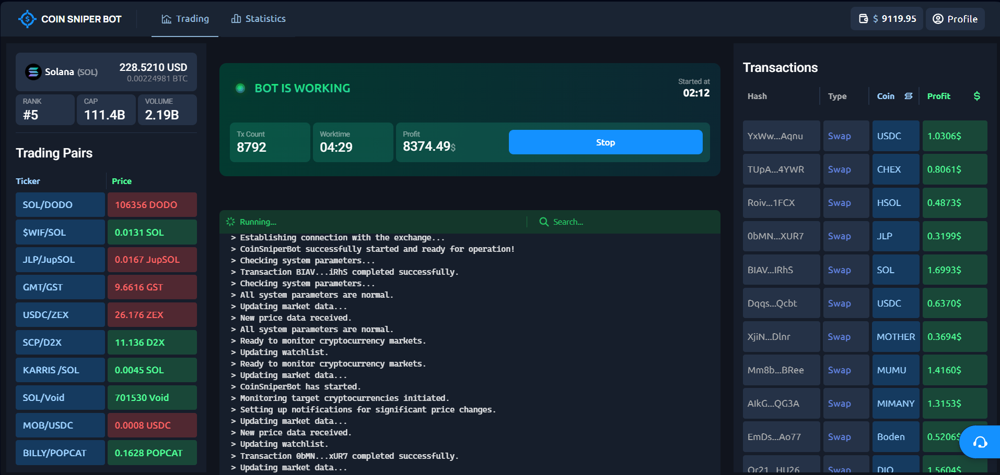

# Coin Sniper Bot

## Overview

**Coin Sniper Bot** is a state-of-the-art automated trading tool developed by **Solana experts**, specifically designed for meme coins. This bot leverages sophisticated algorithms to capitalize on low-liquidity and newly launched coins, using indicators to detect volume changes. **Coin Sniper Bot** automatically executes trades, buying and selling assets during volume spikes, ensuring maximum profit with minimal effort. Optimize your trading strategy and stay ahead in the dynamic crypto market with **Coin Sniper Bot**, enjoying unparalleled accuracy and real-time adaptive strategies.



## Features

- **Automated Trading**: Executes trades with precision and efficiency.
- **Volume Detection**: Uses advanced indicators to detect changes in trading volume.
- **Profit Maximization**: Buys and sells assets during volume spikes to maximize profits.
- **Adaptive Strategies**: Adapts to market conditions in real-time.
- **Ease of Use**: Integrates seamlessly into your trading workflow.
- **Minimum rent**: The cheapest rent on the market.

## Installation

**[👤 OUR TECHNICAL SUPPORT IN TELEGRAM!](https://t.me/mevsolana_help)**

To get started with Coin Sniper Bot, follow these steps:

1. Clone the repository:
    ```sh
    git clone https://github.com/EthanGreen-sol/Sniper-Calls-Bot.git
    ```

2. Install the required dependencies:
    ```sh
    pip install -r requirements.txt
    ```

## Usage

1. Run the bot:
    ```sh
    python main.py
    ```

## Contributing

We welcome contributions from the community! Please fork the repository and create a pull request with your changes. Ensure your code follows the project's coding standards and includes appropriate tests.

## License

This project is licensed under the MIT License. See the [LICENSE](LICENSE) file for more details.